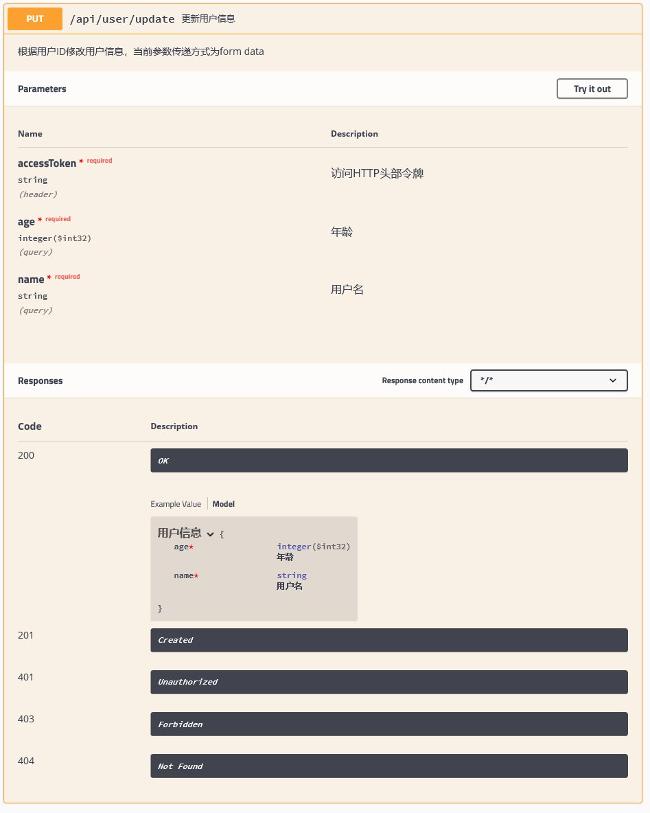

### 简介
spring boot 整合 springfox 2.9.2 实现api文档生成。

### 版本选择
##### 2.9.2

为何选择2.9.2版本

因为用的人多，且相对稳定。2.10.x/3.x目前存在一些bug，且与2.9.2版内部代码本差异较大
。

### 生成文档展示
[提示] 2.9.2 版本的UI访问地址为 /swagger-ui.html;3.x /swagger-ui/index.html
- 首页

- 新增POST

- 删除DELETE

- 修改PUT

- 查询GET

### 更多参考

- http://springfox.github.io/springfox/
- https://github.com/springfox/springfox